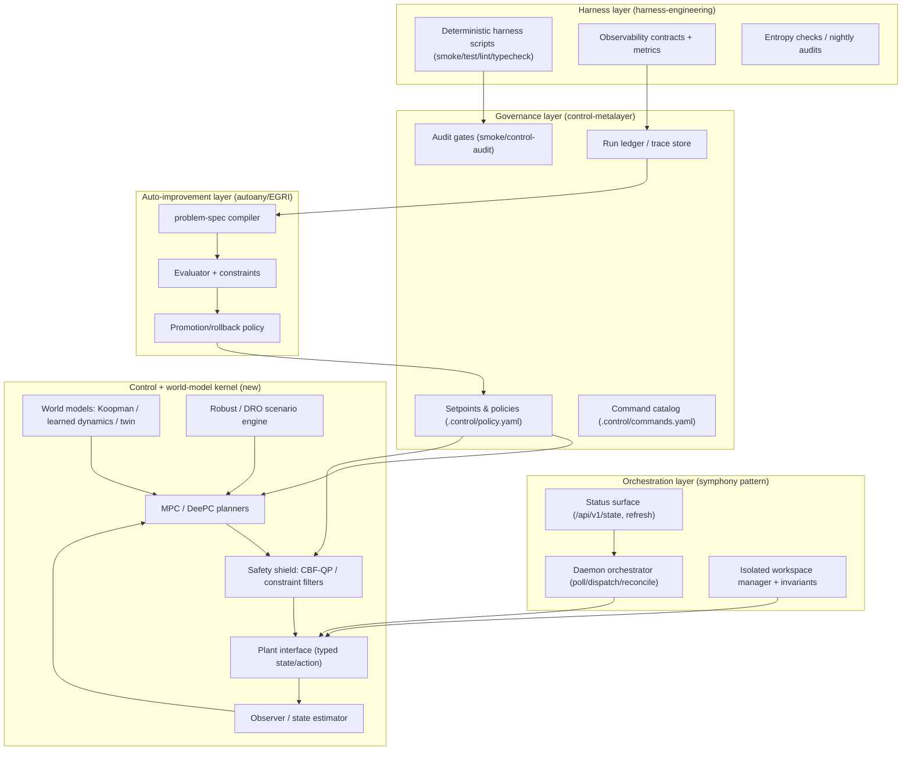
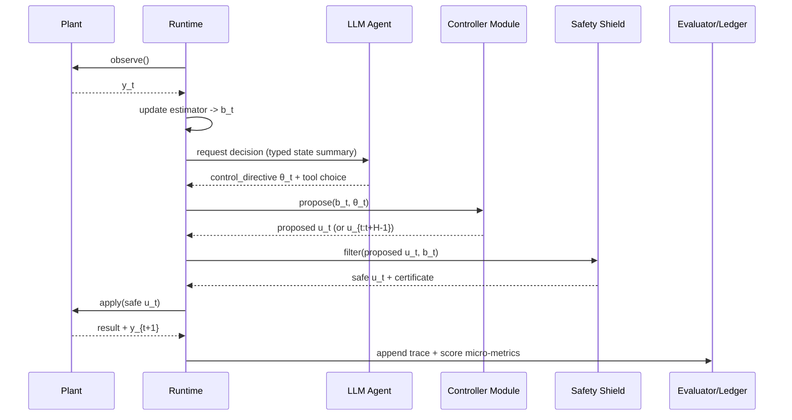

# Unifying an Agentic Control Metalayer for LLM-as-Controller Systems

## Executive summary

A practical way to let an LLM-based agent “function as a control law” is to **treat the LLM as a slow, supervisory, tool-using controller** that emits **typed, auditable control decisions** (setpoints, constraints, model updates, solver configs, plans), while **fast inner loops** (PID/state feedback/MPC/CBF-QP) execute deterministically. This matches the operational realities in modern agent runtimes: agents succeed when the environment is made legible and verifiable through harnesses, contracts, and feedback loops, not when raw autonomy is maximized. citeturn11view0turn16view0turn18view0turn23view0

The four BroomVA projects already form a coherent “control stack” for agentic systems:

- **control-metalayer** provides the *governance layer* (setpoints, gates, sensors, actuators, profiles like “baseline/governed/autonomous,” and an audit loop) meant to stabilize behavior across agent sessions. citeturn10view2turn18view0turn10view0  
- **harness-engineering** provides the *execution harness layer* (deterministic smoke/test/lint/typecheck commands, compact docs, observability templates, entropy management) operationalizing the Harness Engineering doctrine. citeturn11view0turn16view0turn37search1  
- **autoany** provides the *closed-loop improvement kernel* (Evaluator-Governed Recursive Improvement, EGRI): freeze a harness, mutate a surface, evaluate, promote/rollback, log a ledger—explicitly a bounded closed-loop optimizer over artifacts. citeturn12view1turn20view0turn12view0  
- **symphony** provides the *orchestration daemon pattern* (poll → dispatch → per-issue workspace worker → reconcile), with explicit safety invariants (workspace root containment, cwd checks) and an operational status surface; BroomVA’s Rust implementation also formalizes a machine-readable `.control/` directory with policies, commands, topology, and live state. citeturn14view8turn23view0turn24view0turn14view0turn8view0  

The unifying metalayer repository you asked for should therefore focus on **one new missing piece**: a **control-systems “plant interface + safety shield + model-learning + MPC/DeePC/Koopman adapters” module** that can be installed like a skill and that plugs into the existing BroomVA governance/harness/orchestration primitives.

Key design rule (from Autoany) to carry into control: **Do not grant an agent more mutation freedom than your evaluator can reliably judge.** In control terms: do not let the LLM’s action space exceed what your runtime monitors, safety filters, and evaluators can certify. citeturn12view0turn20view0turn12view1

Assumptions (explicit): no fixed platform or cloud; the “plant” can be physical (robot), cyber-physical (process), or purely cyber (cloud ops/workflows). Latency, compute, and safety criticality vary by plant, so recommended loop rates and autonomy levels are presented as **engineering heuristics** to be validated in your harness.

## How the BroomVA repos resonate with control-system architecture

### control-metalayer as “controller governance” and safety envelope

control-metalayer frames agent work as a control system: **setpoints**, **sensors**, **gates**, **feedback loops**, and **escalation budgets**, with a self-evolution process where recurring failures crystallize into enforceable gates in `.control/policy.yaml`. citeturn10view2turn18view0turn10view0

This is directly analogous to safety-critical control practice:

- “Setpoints” ≈ mission objectives / constraints to maintain.
- “Sensors” ≈ telemetry/metrics/CI checks that measure constraint satisfaction.
- “Gates” ≈ certified preconditions (hard constraints) before applying actions.
- “Profiles” ≈ controller modes (manual review vs governed vs autonomous), comparable to switching control policies under supervision. citeturn18view0turn14view2  

### harness-engineering as the “measurement and repeatability substrate”

The Harness Engineering playbook emphasizes that agent performance depends on **deterministic command surfaces, compact actionable constraints, strict boundaries, early observability, and entropy management**, installed via a wizard and templates (AGENTS.md, PLANS.md, harness scripts, CI workflows). citeturn11view0turn16view0

In control language, harness engineering builds:

- a reliable **measurement function** (repeatable tests/metrics),
- an **experiment protocol** (reproducible runs),
- and a **plant sandbox** for safe trials—critical for data-driven control and safe learning. citeturn11view0turn31view2  

### autoany (EGRI) as “outer-loop adaptive control / controller synthesis”

Autoany explicitly defines EGRI as a bounded closed-loop optimizer over executable artifacts and gives a formal tuple Π = (X, M, H, E, J, C, B, P, L). citeturn12view0turn12view1  
Its skill definition operationalizes evaluator-first design, immutable harness construction, mutation-surface minimization, budget enforcement, rollback, and an append-only ledger. citeturn20view0

This maps cleanly to modern control development workflows:

- **Artifact**: controller parameters, cost weights, model structure, safety thresholds, policy code.
- **Harness**: simulator/digital twin + scenario library + regression suite.
- **Evaluator**: cost + constraint violations + robustness + latency.
- **Promotion**: deploy controller version if it improves metrics and passes constraints.

This is precisely how you “approximate to world models and arbitrary system control”: treat world-model learning and controller tuning as **EGRI loops** governed by trustworthy evaluators, rather than a single monolithic end-to-end learned policy.

### symphony as “multi-agent orchestration and workspace safety invariants”

The OpenAI Symphony spec defines a long-running service that polls an issue tracker, creates isolated workspaces, runs coding agents, and exposes observability—all **without requiring a persistent database**, emphasizing deterministic workspaces and explicit safety invariants. citeturn23view0turn24view1turn24view0

Most relevant to control/agentic “plant safety”:

- Safety invariants require the agent to run **only inside the per-issue workspace**, verify `cwd == workspace_path`, ensure workspace path stays within the workspace root, and sanitize workspace keys. citeturn24view0turn24view1  
- The spec is explicit that approval/sandbox posture is implementation-defined but must not stall indefinitely; it must be resolved or fail closed. citeturn24view6turn26view3  
- The runtime contract uses JSON-RPC-like protocol messages over stdio (and optionally WebSockets), and WebSocket mode uses bounded queues with overload errors requiring retry with exponential delay. citeturn26view4turn26view0  

BroomVA’s Rust symphony adds a **machine-readable control metalayer**: `.control/policy.yaml`, `commands.yaml`, `topology.yaml`, `state.json`, plus validation scripts and explicit “per-session” and “per-change” inner loops. citeturn14view0turn14view2turn8view0turn6view0  
That is effectively a ready-made blueprint for how your unifying repository should expose control primitives and audits.

## Formalizing “agent as control law” and defining LLM roles

### A formal agentic control law with tool-mediated actions

Let the plant (arbitrary system) be a partially observed stochastic dynamical system:

- State: \(x_t \in \mathbb{R}^n\)  
- Control input: \(u_t \in \mathbb{R}^m\)  
- Disturbance: \(w_t\)  
- Observation: \(y_t\)

\[
x_{t+1}=f(x_t,u_t,w_t), \quad y_t=h(x_t)+v_t
\]

Define an **agentic controller** as a *tool-using policy* operating on a typed belief state \(b_t\) derived from observations and logs:

\[
b_t = \mathrm{Filter}(b_{t-1}, y_t, a_{t-1}, r_{t-1})
\]

where \(a_{t}\) is a high-level action (a tool call / plan / parameter update), and \(r_t\) are runtime feedback signals (success/failure, metrics).

The LLM-generated decision is *not* the raw \(u_t\) (except in slow plants). Instead, the LLM emits a structured **control directive** \(\theta_t\) that parameterizes deterministic control modules:

\[
\theta_t = \pi_{\text{LLM}}(b_t; \phi)
\]

Examples of \(\theta_t\):
- MPC weights, horizon, constraints, reference trajectories
- CBF barrier parameters, class-\(\mathcal{K}\) function tuning
- model update requests (Koopman lift changes, learned dynamics retraining triggers)
- selection among controllers (switching logic)

A deterministic controller module \(K\) produces a candidate control sequence:

\[
\tilde{u}_{t:t+H-1} = K(b_t,\theta_t)
\]

A **safety filter / shield** \(S\) then projects candidate inputs into the safe set (e.g., via CBF-QP):

\[
u_t = S(\tilde{u}_t, b_t) = \arg\min_{u} \|u-\tilde{u}_t\|^2 \;\text{s.t.}\; \text{SafetyConstraints}(b_t,u)
\]

CBF-QP as a canonical shield is standard: encode safety as barrier constraints and solve a QP each step. citeturn29search11turn29search7turn30search9

Finally, the runtime logs a trace entry \( \ell_t \) into a ledger \(L\) (Autoany-style) and repeats. citeturn20view0turn12view1

This architecture intentionally enforces the Autoany “core law” at runtime: the LLM’s degrees of freedom are limited to \(\theta_t\) and tool calls that can be reliably evaluated and constrained. citeturn12view0turn20view0

### LLM roles in feedback control systems

The LLM can play multiple roles; the critical choice is **where** in the hierarchy it sits.

| LLM role in control stack | What the LLM outputs | Pros | Cons / risks | Latency suitability | Safety risk if misused |
|---|---|---|---|---|---|
| Supervisory controller | setpoints, mode switches, constraints, policy updates | strong for long-horizon reasoning, goals↔constraints translation; aligns with “humans steer, agents execute” harness doctrine citeturn11view0 | may hallucinate goals/constraints; needs typed schemas and audits citeturn31view0turn31view1 | seconds→minutes loops | medium (bounded by safety filters) |
| Receding-horizon planner (tooling MPC) | trajectories, cost weights, scenario sets, horizon settings | can shape MPC behavior without doing QP solves; integrates digital twin rollouts | if it plans infeasible trajectories, solver may fail; needs feasibility recovery | ~0.5–5 s per plan step (plant-dependent) | medium-high |
| Meta-controller over tools | chooses which controller module to invoke (PID/MPC/DeePC/Koopman/RL), triggers identification | modular; supports “policy switching” and “tool selection” agent frameworks citeturn30search2turn32view2 | tool-selection errors; requires strict allowed-tools lists | seconds | medium |
| Online identifier (semantic + statistical) | decides what data to collect, when to update models, what experiments to run | good at experiment design and anomaly interpretation; pairs with DeePC/Koopman workflows citeturn27search0turn29search4turn36search3 | unsafe probing if not gated; needs budget + safety constraints | seconds→minutes | medium-high |
| Controller synthesizer | writes/edits controller code, safety specs, unit tests, config | converts reasoning into deterministic artifacts (Code-as-Policies style) citeturn30search3turn11view0 | code-gen errors; requires harness gating and audits | minutes→hours | low-medium if gated by CI/harness |
| EGRI loop compiler (Autoany) | problem-spec, mutation operators, evaluator design, promotion rules | makes “improve controller” a safe closed-loop process | evaluator gaming/overfitting; requires strong evaluator and anti-gaming checks citeturn20view0 | hours→days | medium |

Two important takeaways:

1. In most physical/fast systems, the LLM should **not** output raw \(u_t\) at servo rates; it should output **controller parameters and plans** that deterministic modules execute. This is consistent with the need for strict safety invariants and non-stalling approval policies in real agent runtimes. citeturn24view0turn24view6turn26view4  
2. In slower cyber “plants” (cloud ops, workflow routing), an LLM can act closer to the control law, because actuation is inherently discrete, typed, and slower—but still requires harnesses, verifiers, and rollback. citeturn12view0turn11view0  

## Harness primitives and APIs needed to make “LLM control laws” real

The unifying metalayer should standardize **runtime primitives** that correspond to control concepts and to the tool-driven agent ecosystems (skills, function calling, structured outputs).

### Typed state, action schemas, and transition feedback

Minimum set of primitives:

- **State schema** (typed “plant state” or belief state):  
  - must separate: measured signals, estimated signals, and semantic/context fields.  
- **Action schema** (typed “actuation”):  
  - discrete actions (API calls), continuous control vectors, or parameter updates.  
- **Transition feedback**:
  - tool call results, plant observations, constraint checks, solver status, timeouts.

These should be enforced using **structured outputs** (JSON Schema) and strict tool schemas so agent outputs are machine-checkable. citeturn31view0turn32view0turn32view4

### Verifiers, safety filters, and audit gates

You need two distinct “safety” layers:

- **Pre-action safety**: “is this action allowed?” (policy gate, approval policy, sandbox rules). Symphony explicitly requires implementations to define approval and sandbox posture and to avoid indefinite stalls. citeturn24view6turn26view3turn23view0  
- **Control-theoretic safety**: ensure \(x_t\) remains in a safe set \( \mathcal{S}\), e.g., via CBF-QP shields that minimally modify a nominal controller. citeturn29search11turn29search7turn30search9

BroomVA symphony’s `.control/policy.yaml` structure makes this explicit in a software setting: setpoints have IDs, measurements, and severities (blocking vs informational), and the system uses gates like `smoke` and `control_audit`. citeturn6view0turn8view0

### Ledger/trace schema and evaluator interface

To integrate with Autoany (EGRI), your metalayer repository should ship a **canonical trace format**:

- trace_id, timestamp, plant_id, controller_version
- state snapshot (or hash + artifact pointer)
- action proposed vs action applied (after safety filter)
- constraints checked + results
- evaluator metrics (cost, violations, latency, robustness indicators)
- rollback/promotion decisions

Autoany’s skill explicitly requires an append-only ledger, rollback, budgets, and a separation between evaluator and mutable artifact. citeturn20view0  
BroomVA symphony’s `.control/state.json` is an example of “live metric snapshot” and gate status, updated by scripts. citeturn14view0turn8view0

### Why “skills” packaging matters for the repo design

Your goal (“installable metalayer as a SKILL”) aligns with the broader agent-skills ecosystem:

- The **skills CLI** (`npx skills add …`) installs SKILL.md-defined bundles to multiple agents and supports project vs global installs. citeturn35view0turn35view2  
- OpenAI’s “skills” docs also describe uploading and mounting skills into hosted shell environments, reinforcing that skills are a first-class distribution artifact. citeturn35view3  

So the unifying repository should be “skills-first”: the control metalayer should be installable into arbitrary repos via the skills tool, and it should generate the typed schemas, harness scripts, and control adapters as templates—exactly how BroomVA’s control-metalayer-loop and harness-engineering-playbook are already structured. citeturn18view0turn16view0turn35view0  

## Mapping modern control methods to agent architecture components

This section “plugs in” the control techniques you listed into the BroomVA-style agent harness stack.

### Data-driven MPC and DeePC

**DeePC** uses input/output trajectory data (Hankel matrices; behavioral “fundamental lemma” lineage) for prediction and optimization without an explicit parametric model. citeturn27search0turn36search3  
Regularized / distributionally robust DeePC formulations interpret regularization as a distributionally robust optimization (DRO) principle and provide probabilistic robustness guarantees. citeturn27search8turn27search4

**Agent mapping**:

- Harness primitive: dataset store + experiment runner (collect trajectories).
- Control module: DeePC optimizer (QP/convex program) treated as a tool.
- LLM role: choose excitation experiments, select horizons/regularization, interpret results, update constraints.
- Safety: wrap DeePC output with CBF-QP shield or robust constraint tightening.

### Control Barrier Functions as runtime safety shields

CBFs are a control-theoretic method to enforce safety constraints by solving a QP that minimally modifies a nominal action while ensuring forward invariance of a safe set. citeturn29search11turn29search7turn30search9  
They are widely integrated with MPC and learning for safety-critical systems (including safe exploration frameworks). citeturn30search9turn30search1turn36search5

**Agent mapping**:

- CBF module lives in the runtime as a **hard safety filter**.
- LLM is not trusted to “be safe”; it can tune margins, select constraints, or propose candidate actions—then the CBF shield enforces invariants.
- Verification: CBF-QP feasibility becomes a gate; if infeasible, fall back to safe controller and raise an incident in the ledger.

### Koopman methods as learned linear predictors for MPC

Koopman-based control lifts nonlinear dynamics into higher-dimensional observable space where linear predictors enable efficient MPC, but approximation errors require explicit error bounds and stability analysis. citeturn33view1turn29search2turn27search10  
Recent survey work explicitly frames Koopman control around error bounds and closed-loop guarantees. citeturn33view1turn29search4

**Agent mapping**:

- World-model module: Koopman lift learning (EDMD variants) as an updatable artifact.
- Control module: Koopman-MPC using the lifted linear system.
- LLM role: decide when to relearn lifts, curate datasets, interpret model mismatch indicators, pick robust strategies (tightening/terminal sets).

### MPC–RL hybrids and safe learning

Hybrid MPC–RL systems often use RL to tune MPC parameters online or to augment MPC with learned components, while preserving constraint-handling benefits of MPC. citeturn30search0turn30search1  
Safe model-based RL frameworks explicitly combine MPC with CBF constraints and learn parameters (e.g., class-\(\mathcal{K}\) functions) while enforcing safety. citeturn30search1turn36search5  
Safe RL surveys emphasize constraint formulations and methods for safety-critical learning. citeturn28search13turn28search17turn28search9  

**Agent mapping**:

- RL policy is treated as a **proposal generator** or parameter tuner (slow loop), not the final actuator.
- MPC remains the execution policy with constraints; CBF remains the hard shield.
- Autoany/EGRI runs offline/async to improve policies with strong evaluators.

### Differentiable control and differentiable MPC

Differentiable MPC provides a pathway to embed MPC in end-to-end learning pipelines (RL/imitation) by differentiating through the MPC solution. citeturn27search3turn27search19

**Agent mapping**:

- Differentiable control is primarily a **learning pipeline primitive** (for model/parameter learning), not a runtime LLM primitive.
- LLM role: generate model structures, loss definitions, training harness scripts; interpret gradients and training failures; gate deployments via harness tests.

### Distributionally robust control and distributionally robust MPC

DRO-inspired control methods (including distributionally robust MPC) treat uncertainty as ambiguity sets around empirical distributions (e.g., Wasserstein balls) and optimize worst-case expectations. citeturn28search0turn27search8

**Agent mapping**:

- Runtime: robust MPC module that consumes uncertainty sets and scenario batches.
- Harness: scenario generator and stress testing (“red team” for dynamics).
- LLM: curates scenario sets, chooses robustness radii and tradeoffs, but promotion requires evaluator-based validation.

### Learned dynamics and digital twins as “world models”

Model-based RL is explicitly about learning environment models to plan/control with fewer real-world trials. citeturn28search11turn28search15  
Digital twin reviews emphasize real-time virtual replicas supporting monitoring, simulation, prediction, and optimization, often by integrating multi-source data flows. citeturn28search2turn28search10turn28search18

**Agent mapping**:

- Digital twin provides the **harness** for safe experimentation and scenario evaluation.
- Learned dynamics (neural ODEs, Koopman, GP, etc.) are artifacts improved via EGRI loops.
- The LLM is most valuable for **semantic integration**: mapping business/mission goals to evaluators and constraints; selecting what to simulate.

### A concise “method → component” mapping

| Control technique | Metalayer component | What must be typed/verified | Best LLM use |
|---|---|---|---|
| Data-driven MPC / DeePC | `control/deepc/` module + dataset store | data provenance, excitation conditions, solver feasibility | experiment design, config tuning, interpreting drift citeturn27search0turn36search3 |
| CBF / HOCBF / learned CBF | `safety/shield/` module (QP) | constraint set, feasibility, barrier evaluation | choose constraints/margins; never bypass shield citeturn29search11turn30search9 |
| Koopman + MPC | `world_models/koopman/` + `control/mpc/` | lift definition versioning, error bounds sanity checks | dataset curation + retraining triggers citeturn33view1turn29search2 |
| MPC–RL hybrids | `control/hybrid/` + eval harness | RL proposal bounds, safe fallback | tune MPC weights; policy search under evaluator citeturn30search1turn28search13 |
| Differentiable control | `learning/diff_control/` | reproducible training, gradient checks, rollback | write training harness, loss specs, tests citeturn27search3turn27search19 |
| DRO / robust control | `control/robust/` + scenario engine | uncertainty set definition, worst-case evaluation | scenario generation + tradeoff selection citeturn27search8turn28search0 |
| Digital twins | `twin/` runtime + scenario library | twin validity, calibration metrics | orchestrate sim experiments; interpret mismatches citeturn28search2turn28search10 |

## Multi-rate hierarchy, safety guarantees, and failure modes

### Multi-rate design: which loops LLMs should and shouldn’t control

Symphony’s spec and the Codex app-server protocol reflect a reality: agent runtimes are **message-driven**, tool-mediated, and subject to timeouts, load, and approval workflows—excellent for supervisory control, not for hard real-time servo loops. citeturn24view0turn26view4turn26view1turn24view6

A practical multi-loop architecture:

- **Inner loop (hard real-time)**: deterministic controllers (PID/state feedback/MPC at fixed dt), CBF-QP shield; no LLM in the loop.
- **Mid loop (soft real-time)**: MPC planning updates, state estimator resets, model updates triggered by drift monitors.
- **Outer loop (supervisory)**: LLM sets goals/constraints, selects control modules, approves escalations, writes new control artifacts.
- **Meta loop (EGRI)**: Autoany-style recursive improvement of models/controllers in a harnessed environment.

Heuristic loop-rate suitability (illustrative, validate per plant):

| Loop type | Typical cadence | Put LLM here? | Rationale |
|---|---|---|---|
| Servo stabilization (motors, attitude) | milliseconds | No | requires deterministic deadlines; tool-call runtimes are not designed for fixed-cycle guarantees citeturn26view4turn24view0 |
| Constrained control execution (MPC/CBF-QP) | tens–hundreds of ms | No (except parameter updates) | solve QPs/NLPs deterministically; use LLM to tune weights/setpoints |
| Supervisory planning / mode switching | seconds | Yes | aligns with tool-driven agents, typed actions, approvals citeturn32view2turn24view6turn11view0 |
| Auto-tuning / controller synthesis via EGRI | minutes–days | Yes | requires evaluator-first + rollback + ledger citeturn20view0turn12view1 |

### Safety and verification mechanisms with runtime guarantees

A robust agentic control system should combine:

- **Workspace / actuation containment**: enforced execution boundaries akin to Symphony’s workspace invariants (cwd checks, root containment, sanitization). citeturn24view0turn6view0  
- **Formal safety shields**: CBF-QP constraints (and combinations with MPC) to guarantee invariance of safe sets during runtime. citeturn29search11turn30search1  
- **Distributional robustness**: DRO-based MPC/DeePC formulations and scenario stress tests to reduce sensitivity to model/data shifts. citeturn27search8turn28search0  
- **Mechanical audits and gates**: setpoint catalogs with explicit measurements and severity; CI gates as “sensors.” BroomVA symphony’s control documents list sensors and actuator maps for audits. citeturn14view5turn14view0turn8view0  
- **Operational safety practices**: red-teaming, human oversight in high-stakes domains, and constrained inputs/outputs. citeturn31view2turn11view0  

### Failure modes and mitigations

Common failure modes when LLMs participate in control:

- **Spec/constraint hallucination**: LLM invents constraints, misreads units, or forgets invariants.  
  Mitigation: JSON-schema structured outputs + strict tool schemas + policy gates + “allowed_tools” restriction. citeturn31view0turn32view2turn32view0  

- **Unsafe exploration / probing**: LLM runs aggressive identification experiments.  
  Mitigation: EGRI budgets + hard constraints + CBF shield; enforce “evaluator-first” and sandbox modes. citeturn20view0turn12view3turn30search9  

- **Latency spikes / overload**: tool runtimes reject/queue requests (bounded queues; server overloaded).  
  Mitigation: multi-rate design; fallback controllers; exponential backoff; don’t place LLM in fast loops. citeturn26view4turn24view5turn26view0  

- **Evaluator gaming / overfitting** (outer-loop learning): the agent learns to exploit metric loopholes.  
  Mitigation: holdout scenario sets, adversarial tests, immutable evaluator artifacts, and “never mutate evaluator and artifact in the same trial.” citeturn20view0turn31view2  

- **Tool-call side effects without approvals**: executing destructive actions.  
  Mitigation: explicit approval policies (Codex app-server) and fail-closed policies (Symphony). citeturn26view3turn24view6turn24view0  

## Blueprint for a unifying metalayer repository and a prototype roadmap

### Blueprint architecture

The architecture should treat BroomVA’s skills and Symphony-style orchestration as the “operating system,” and add a control-and-world-model kernel that can be installed anywhere.

This diagram is grounded in: (a) control-metalayer’s policy/gate approach citeturn18view0turn10view2, (b) harness-engineering’s deterministic harness doctrine citeturn11view0turn16view0, (c) Symphony’s orchestrator/workspace safety invariants and status API citeturn23view0turn24view0turn24view4, and (d) Autoany’s evaluator-governed loop model citeturn12view1turn20view0.

### Concrete repo layout

A “unifying metalayer” repo should be both:

1) a **skills repo** (installable via `npx skills add …`), and  
2) a **library repo** (re-usable Python/Rust modules for runtime control).

Proposed layout:

- `.skills/`
  - `control-metalayer-loop/` (vendor or submodule; keep upstream-compatible) citeturn18view0  
  - `harness-engineering-playbook/` (vendor or submodule) citeturn16view0  
  - `autoany/` skill (vendor or submodule) citeturn20view0  
  - `symphony-adapter/` (new skill)
    - templates for `WORKFLOW.md` and an orchestration daemon config consistent with Symphony spec concepts citeturn23view0turn24view1  
  - `control-kernel-bootstrap/` (new flagship skill)
    - installs typed plant/action schemas, safety shields, and evaluation harness templates

- `schemas/`
  - `state.schema.json`
  - `action.schema.json`
  - `trace.schema.json`
  - `evaluator.schema.json`  
  (use strict JSON schema design consistent with structured outputs + tool calling patterns) citeturn31view0turn32view4  

- `runtime/`
  - `daemon/` (Symphony-like scheduler; can be Rust or Python; must expose state surface consistent with `/api/v1/*` spec ideas) citeturn24view4turn14view8  
  - `policy/` (load `.control/policy.yaml`, enforce profiles) citeturn14view2turn18view0  
  - `tooling/` (function-call tool wrappers; allowed-tools sets) citeturn32view2turn31view1  

- `control/`
  - `mpc/` (wrappers over NMPC tooling; deterministic solvers) citeturn38search1turn38search0  
  - `deepc/` (DeePC and robust DeePC) citeturn27search0turn27search8  
  - `koopman/` (Koopman learning + Koopman-MPC) citeturn33view1turn29search2  
  - `shield/` (CBF-QP safety filter) citeturn29search11turn29search7  
  - `robust/` (DRO/scenario MPC helpers) citeturn28search0turn27search8  

- `world_models/`
  - `digital_twin/` (interfaces + adapters for simulators; calibration hooks) citeturn28search2turn28search10  
  - `learned_dynamics/` (model learning harnesses; versioned artifacts) citeturn28search11turn28search15  

- `evals/`
  - scenario libraries, regression baselines, stress tests, and acceptance thresholds (Autoany-compatible evaluators) citeturn20view0turn12view0  

- `.control/` (generated into target repos by skills)
  - `policy.yaml`, `commands.yaml`, `topology.yaml`, `state.json` (mirroring BroomVA symphony’s metalayer pattern) citeturn14view0turn8view0  

### API spec highlights for the control kernel

At minimum, standardize these interfaces (language-agnostic; implementable in Python/Rust):

- `Plant`:
  - `observe() -> Observation`
  - `apply(action: Action) -> ActuationResult`
  - `reset(seed?)`
  - `constraints() -> ConstraintSet`

- `Estimator`:
  - `update(obs) -> belief_state`
  - optional `predict(belief_state, action_seq)`

- `Controller`:
  - `propose(belief_state, setpoint, constraints, world_model) -> ProposedActionSeq + metadata`

- `SafetyShield` (CBF-QP / rule-based):
  - `filter(proposed_action, belief_state) -> safe_action + certificate`

- `Evaluator` (Autoany-compatible):
  - `score(trace_batch) -> ScoreVector`
  - `promotion_decision(score, constraints_ok) -> promote/rollback/branch` citeturn20view0turn12view1  

- `TraceSink`:
  - `append(trace_event)`
  - `query(filters)`

Critically, the **LLM never directly calls Plant**; it calls only `Controller` or `MetaController` tools with strict schemas, and the runtime is responsible for all plant interactions and safety enforcement. This operationalizes the “agent gets only as much freedom as we can judge” principle. citeturn12view0turn32view2turn24view6

### Control-flow loop for a single tick

The safety/shield and trace logging align with CBF-QP practice citeturn29search11turn30search9 and with Autoany’s harness/ledger doctrine citeturn20view0turn12view1.

### Toolchains to prioritize for a prototype

Given your “no platform constraint” requirement, prioritize tooling that supports:

- fast MPC/NMPC and estimation: **acados** (fast embedded NMPC/MHE) citeturn38search1  
- nonlinear optimal control + autodiff: **CasADi** citeturn38search0turn38search20  
- convex QPs for CBF shields and MPC subproblems: **OSQP** citeturn38search2turn38search14  
- convex modeling for rapid prototyping: **CVXPY** citeturn38search3turn38search7  

For agent-side typing and robustness:
- OpenAI structured outputs (`response_format: json_schema`, strict mode) citeturn32view0  
- OpenAI function calling with strict JSON schema tools and allowed-tools restriction citeturn32view2turn32view4  
- Codex app-server protocol when controlling a coding agent or tool-executing agent via JSON-RPC. citeturn26view4turn26view1turn24view3  

### Case studies that naturally fit this metalayer

**Robotics / embodied systems**  
Use the “Code as Policies” pattern: LLM generates policy code that calls control primitives (waypoints, impedance, etc.) rather than streaming raw torques. citeturn30search3turn30search7  
Then insert CBF-QP shields and MPC planning under the hood. citeturn29search11turn30search1  

**Cloud ops (autoscaling, incident response)**  
Treat the cloud platform as the plant; actions are typed (scale up/down, restart service, change routing), and safety constraints are SLO/SLA budgets. Symphony-style orchestration plus harness engineering (observability legibility, deterministic scripts) is directly aligned with this domain. citeturn23view0turn11view0turn14view8  

**Business workflows (routing, approvals, compliance)**  
Autoany’s EGRI explicitly lists “Workflow/Ops” as a domain mapping: mutate routing policies or decision graphs, evaluate on replay, promote with rollback. citeturn12view2turn20view0  

### Actionable prototyping roadmap with evaluation metrics

Milestone goals are phrased as “what to build + what to measure,” consistent with harness-first and evaluator-first doctrine. citeturn11view0turn20view0

**Phase foundation: metalayer bootstrap**
- Deliver a `control-kernel-bootstrap` skill that installs:
  - `.control/` scaffolding (policy/commands/topology/state)
  - typed schemas (`state`, `action`, `trace`)
  - harness scripts and CI gates
- Metrics:
  - audit pass rate (`smoke`, `control-audit`)
  - schema validation pass rate
  - trace completeness rate (no missing fields)  
Grounding: BroomVA control-metalayer wizard + symphony metalayer files. citeturn18view0turn14view0turn8view0

**Phase safety: implement shields and containment**
- Implement `shield/cbf_qp` module and a policy gate layer (approval/sandbox posture).
- Enforce invariants analogous to Symphony workspace invariants for any “plant adapter” (path containment, restricted execution context). citeturn24view0turn6view0  
- Metrics:
  - constraint violation rate (target 0 for hard constraints)
  - shield feasibility rate and fallback frequency
  - mean time to detect unsafe proposals

**Phase modeling: world models and learned dynamics**
- Add a minimal digital twin interface and at least one learned model path (Koopman or neural dynamics).
- Integrate drift detection and retraining triggers.
- Metrics:
  - multi-step prediction error under scenario library
  - closed-loop cost improvement vs baseline
  - robustness under distribution shift scenarios  
Grounding: Koopman control surveys + model-based RL surveys. citeturn33view1turn28search11turn28search2

**Phase planning: MPC/DeePC integration**
- Implement:
  - MPC planner interface (CasADi/acados adapter)
  - DeePC adapter (data store + optimizer)
- LLM role restricted to: setpoints, constraints, tuning knobs, module selection.
- Metrics:
  - solve time distributions
  - feasibility and recursive feasibility in test scenarios
  - comparative performance vs model-free baseline  
Grounding: DeePC papers and ML-based MPC review. citeturn27search0turn27search8turn33view0

**Phase auto-improvement: EGRI over controllers**
- Integrate Autoany-style problem-spec and ledger so controller tuning is an explicit recursive improvement loop.
- Metrics:
  - promotion success rate (improvements that generalize to holdout scenarios)
  - regression rate (promoted versions later rolled back)
  - evaluator reliability (agreement between offline replay and online outcomes)  
Grounding: Autoany formal model and safety rules. citeturn20view0turn12view1

### Prioritized references

Primary/official sources most directly supporting the design:

- Harness engineering doctrine and agent-first workflow design (entity["company","OpenAI","ai lab"]). citeturn11view0  
- Symphony service spec (workspace safety invariants, orchestration layers, `/api/v1/*`, approval policy requirements). citeturn23view0turn24view0turn24view4turn24view6  
- Codex app-server protocol (JSON-RPC, thread/start, turn/start, approvals, bounded queues). citeturn26view4turn26view1turn26view0turn26view3  
- BroomVA symphony metalayer (`.control/` directory definition, profiles, gates, sensors/actuators, state snapshots). citeturn14view0turn14view2turn14view5turn8view0  
- Autoany EGRI formalism and skill safety rules. citeturn12view1turn20view0turn12view0  
- DeePC + robust DeePC. citeturn27search0turn27search8turn36search3  
- CBF-QP foundations and CBF+learning integrations. citeturn29search11turn29search7turn30search9turn30search1  
- Koopman control survey with closed-loop guarantees. citeturn33view1  
- Digital twin reviews for world-model framing. citeturn28search2turn28search10turn28search18  
- Differentiable MPC. citeturn27search3turn27search19  
- Skills packaging ecosystem (skills CLI by entity["company","Vercel","cloud platform"]; skills docs). citeturn35view0turn35view3  

Suggested next steps (prototype order):

1) Build the **control-kernel-bootstrap skill** that installs schemas + `.control/` + audits into any repo. (You already have the scaffolding patterns in control-metalayer-loop and harness-engineering-playbook.) citeturn18view0turn16view0  
2) Implement the **SafetyShield** first (CBF-QP + policy gates), then only allow the LLM to output \(\theta_t\) and tool selections. citeturn29search11turn12view0turn24view6  
3) Add **one** world model path (Koopman or a small learned dynamics model) plus a scenario library; wire it into MPC. citeturn33view1turn33view0  
4) Integrate Autoany’s EGRI loop so model/controller updates are evaluator-governed and rollback-capable. citeturn20view0turn12view1